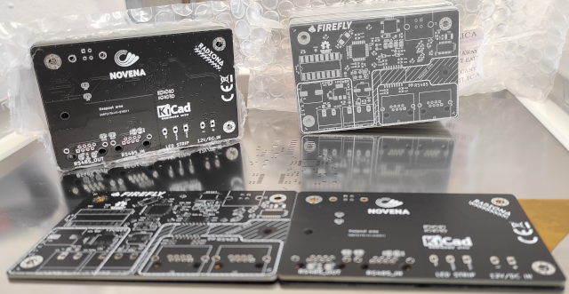
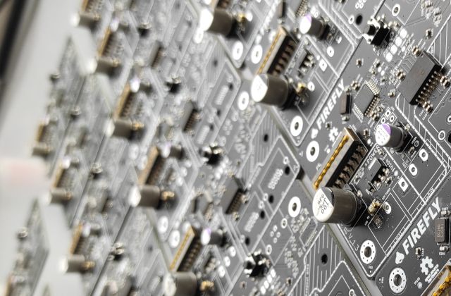
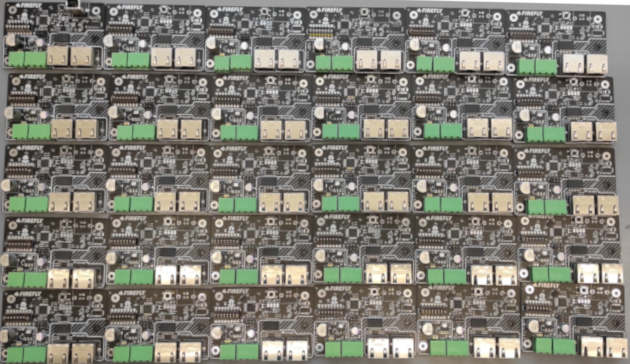
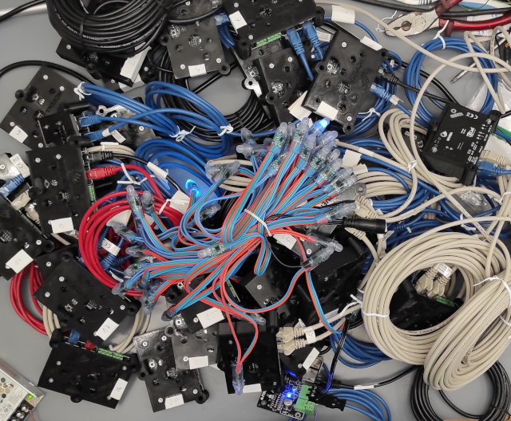

# Firefly

Board is designed to run custom made panels designed by Novena.

Designed to drive LED strip WS28121/WS28121

Depending on components and jumpers board can be sender or receiver. 

RJ45 connector is used as it is cheap.

UTP Cables are cheap and easyly available.

Sender board is connected ove USB to computer.

Currently sender board is just use as USB > RS485 pass

On receiver board switches are used to set panel ID

On computes software we can assign each LED to one or more grups and change group color with just one message.

Currently this board is using custom designed RS485 protocol.

Simple example of using LED group

https://www.youtube.com/watch?v=NDzNr1LaLNI

Example with more features implemented

https://youtu.be/98tDE7uqz9s

Testing blender render 

https://www.youtube.com/watch?v=SnCAtjjVjGQ

Parts of schematics are from:

https://github.com/TimGremalm/LightBoxNano

PCBart blender style

https://github.com/pcbarts/stylized-blender-setup

40 pcs batch for museum instalation

DMX test

https://www.youtube.com/watch?v=Ih8ujr5BlC8

https://www.youtube.com/watch?v=qBxfGmqJY24

https://www.youtube.com/watch?v=aGFyOSpUzw4

https://www.youtube.com/watch?v=s4EHGpA8z-Q&t=11s
